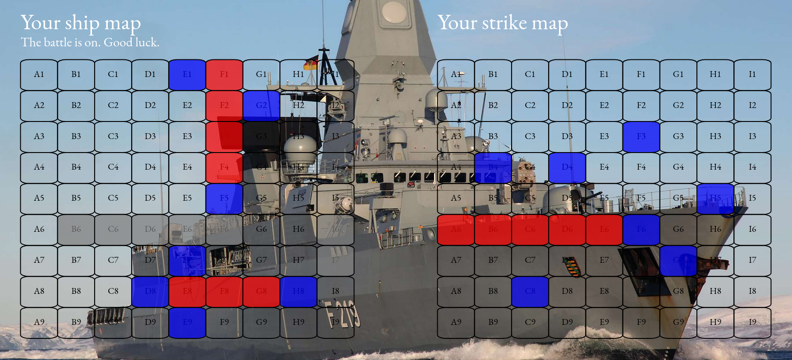

# Alphazero implementation for the game battleship

This program solved the game of battleship using alphazero and provides a web interface for playing.



## Getting started

To make sure pyenv is active in the shell:

```bash
export PYENV_ROOT="$HOME/.pyenv" && export PATH="$PYENV_ROOT/bin:$PATH" && eval "$(pyenv init -)"
```

Create a pyenv:

```bash
pyenv virtualenv 3.12.2 alphazero
```

Running a training run with the parameters in `hyperparameter.json`:

```bash
bash train.sh
```

Tensorboard for live stats:

```bash
poetry run tensorboard --logdir logs --port 6006
```

## Eval

Comparing different agents performance:

```bash
bash eval.sh
```

## User interface

```bash
bash interface.sh
```

## Battleship

The game battleship is a board game with two players whereas each player has two maps. 
At first each player places a set of discrete ships on a discrete ship map.
After which the battle phase begins. During the phase each player guesses the position of the opponents ships.
Hits on the others shipmap are being stored on the respective hitmaps.  

## Alphazero

Alphazero is a model-based deep reinforcement learning algorithm.<br/>
The most capable agent achives victory in about 29 moves in the mean on a 9x9 battleship game with ```ships = [5, 4, 3, 2]``` while playing against a human which needs around 42 moves in the mean. 
